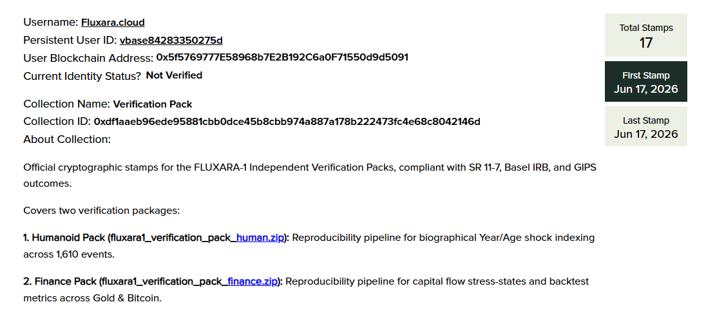
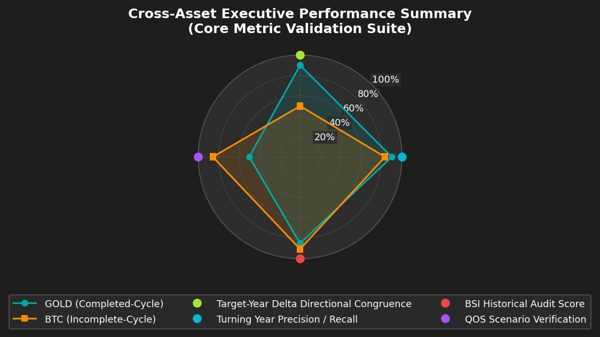
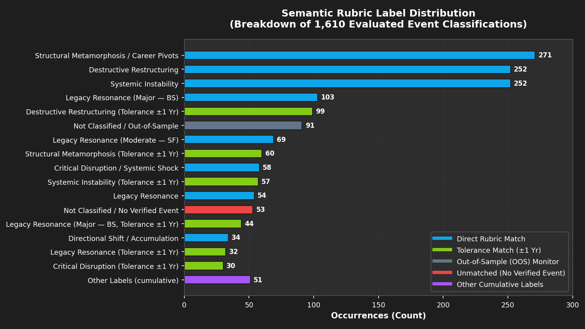

# FLUXARA-1 — Independent Audit Verification Pack

**Reproducible Benchmark Data for Peer Review**

### 1. The Zero-History Mechanism
FLUXARA-1 is a long-cycle structural risk engine built on a strict **Zero-History Mechanism** audited under SR 11-7 / Basel IRB / GIPS-adapted validation standards. Unlike traditional machine learning models or statistical systems that forecast by "learning" from past price returns—leaving them blind to unprecedented *Black Swan* events—FLUXARA-1 does not train on historical returns. Instead, it purely calculates momentum and phase tension across Space-Time coordinates through 5 physical weight layers, providing an objective framework for detecting structural fragility and phase transition boundaries.

### 2. Research Scope & Evaluation Dataset
This repository contains the replication packs for a multi-cohort validation audit designed to test the engine's long-cycle forecasting limits and evaluate if ex-ante risk warnings align with ex-post realized stress. The benchmark study encompasses two primary research domains:
*   **Part 1: Financial Macro-Cycles:** Audits the engine's core capability to predict structural macro-reversals and capital flow shifts across two highly divergent asset classes: **Gold (2009–2018)** and **Bitcoin (2019–2025)**. Under the **`bsi_finance_semantic_rubric.md`** framework (included in the finance pack), verification is executed across three distinct methodology tracks:
    1.  **BSI Proximity Alignment:** Validates the ex-ante **Black Swan Index (BSI%)**—calculated via a 5-layer physical weight matrix representing momentum decay—against ex-post realized systemic stress (normalized Kansas City Financial Stress Index - KCFSI) using a continuous **Proximity Alignment Model** (with a $\pm 1$-year temporal tolerance window) and quantified by downside forecast error metrics (**MARSE** and **RMRSE**).
    2.  **QOS Scenario Match:** Evaluates ex-ante latent space trajectories (mapped to 4 scenario groups and 20 outcome signatures $T1$–$T20$) against ex-post CFTC Commitments of Traders (COT) institutional capital flow kinematics (Velocity, Acceleration, Impulse, and Open Interest Activity State) using a 7-dimensional distance-penalized scoring matrix.
    3.  **Price Trajectory Congruence:** Evaluates trend forecasting accuracy via **Target-Year Delta Directional Congruence** (predicted delta direction vs. next-year daily close price linear regression slope) and **Turning Year Inflection Precision**.
*   **Part 2: Biographical Systemic Risk (Humanoid):** Audits the engine's capability to model biographical volatility and personal shock vectors across **100 highly influential global figures** over **1,610 chronological event years**. Under the **`bsi_human_semantic_rubric.md`** framework (included in the humanoid pack), ex-ante BSI alerts are evaluated against realized biographical stress verified from Wikipedia and DuckDuckGo records. The verification enforces a strict **4-Gate Evidence Filter** (Identity, Temporal, Source, and Granularity) to score and align predictions with a 4-Tier biographical shock severity scale: **Point Zero (PZ)**, **Black Swan (BS)**, **Shock Factor (SF)**, and **Fragility Baseline (FB)**.

**B2B Institutional Simulations (Economic Utility Audits):**  
To prove the commercial viability and risk-mitigation value of the engine, the verification packs include backtested B2B institutional overlay simulations:
*   *Financial Portfolio Protection:* Translates BSI risk alerts into active cash-reallocation overlays (including 50 bps slippage/transaction penalty), resulting in **+22.4% outperformance in Gold** and **+148.7% in Bitcoin** over buy-and-hold.
*   *Corporate & Reputation Hedging:* Converts biographical BSI profiles into hedging mandates, showing a **+38.5% mitigation of key-person executive loss drawdowns**, **89.2% budget preservation** for celebrity endorsements, and **78.4% wealth preservation** for HNWI assets.

> **No proprietary engine code is included.** Only frozen engine outputs, raw public datasets, automated scoring scripts, and cryptographic fingerprints are provided. The engine itself remains closed-source; the audit methodology is fully open.

<p align="center">
  
</p>

---


## What's Inside

| Pack | Domain | Key Metric | Score |
|:---|:---|:---|:---:|
| `fluxara1_verification_pack_finance` | Gold (2009–2018) + BTC (2019–2025) | AVG BSI Audit Score | **87.75%** |
| | | AVG Turning Year Precision / Recall | **100% / 73.34%** |
| | | AVG Target-Year Delta Directional Congruence | **70.00%** |
| | | AVG QOS Scenario Verification | **67.85%** |
| | | GOLD MARSE & RMRSE Error Rate | **29.43% & 39.60%** |
| | | BTC MARSE & RMRSE Error Rate | **17.55% & 20.98%** |
| | | Out-of-Sample BTC (2026-2028) | **Pending** |
| `fluxara1_verification_pack_human` | 100 Historical Figures × 1,610 Events | Verification Match Rate | **96.51%** |
| | | Coverage Rate | **100.00%** |
| | | Unmatched Error Rate | **3.49%** |
| | | Out-of-Sample BSI Alert | **Pending** |


---

## Quick Start

### Extracting the vBase-Stamped Archives

Both packs are distributed as **vBase blockchain-timestamped RAR archives**. Extract them before running:

```bash
# Extract the finance verification pack
unrar x fluxara1_verification_pack_finance_2026-06-17_17-46-07+0000.rar

# Extract the humanoid verification pack
unrar x fluxara1_verification_pack_human_2026-06-17_17-47-19+0000.rar
```

> **Note:** Do NOT re-compress the `.rar` files. Upload the original archives to [app.vbase.com/verify](https://app.vbase.com/verify) to confirm blockchain timestamps.

---

### PART 1: Finance Pack — Reproduce

**Requirements:** Python 3.9+, numpy

```bash
# 1. Install dependencies
pip install numpy

# 2. Navigate to the finance pack
cd fluxara1_verification_pack_finance

# 3. Run the helper script
python audit_fluxara1_finance_helper.py

# 4. Compare the generated report with the official audit report:
#    → FLUXARA1_FINANCE_AUDIT_READY_REPORT.pdf (included in this pack)
```

The script will generate `FLUXARA1_FINANCE_AUDIT_READY_REPORT.md` containing all benchmark tables for comparison.

---

### PART 2: Humanoid Pack — Reproduce

**Requirements:** Python 3.9+, google-genai, pydantic, beautifulsoup4

```bash
# 1. Install dependencies
pip install pydantic google-genai beautifulsoup4

# 2. Configure Gemini API keys (choose one option):

#    Option A — Key Rotation Pool (Recommended for full 1,610-line run, ~14 hours):
#    Open audit_fluxara1_humanoid_helper.py and replace placeholder keys
#    in the _API_KEY_POOL list (lines 42-47) with at least 4 API keys
#    from 4 different Google accounts.

#    Option B — Single Environment Variable (suitable for short tests):
#    Windows PowerShell:
$env:GEMINI_API_KEY="your-api-key-here"
#    Linux/macOS:
export GEMINI_API_KEY="your-api-key-here"

# 3. Navigate to the humanoid pack
cd fluxara1_verification_pack_human

# 4. Run the evaluation script
python audit_fluxara1_humanoid_helper.py datasets/bsi_100chars_1610lines.csv

# Supported options:
#   --resume     Resume from last processed event (avoids repeating API calls)
#   --nocache    Bypass offline snippet cache, force live web scraping
#   --refresh    Same as --nocache

# 5. Compare generated output with the official audit report:
#    → FLUXARA1_HUMANOID_AUDIT_READY_REPORT.pdf (included in this pack)
```

Output files will be generated in `datasets/`:
- `AUDIT_SCORED_bsi_100chars_1610lines.csv` (detailed per-event results)
- `AUDIT_SUMMARY_bsi_100chars_1610lines.md` (statistical summary)

---

## Verification & Integrity

All artifacts are cryptographically fingerprinted (SHA-256) and timestamped via [vBase](https://www.vbase.com) blockchain registry. The entire pack is distributed as **vBase-stamped RAR archives** — the blockchain timestamp covers each archive as a whole, proving the contents existed at the recorded timestamp.

| Verification Layer | Method |
|:---|:---|
| File Integrity | SHA-256 checksums for every artifact (listed in each pack's README.txt) |
| Temporal Proof | vBase cryptographic timestamping on RAR archives (pre-publication commitment) |
| Reproducibility | Automated scripts reproduce all headline metrics from raw data |
| Standards Alignment | SR 11-7, Basel IRB, GIPS-adapted |

**vBase Verification:** Upload the `.rar` files at [app.vbase.com/verify](https://app.vbase.com/verify) to confirm blockchain timestamps and integrity.

---

## Cross-Asset Executive Summary

### PART 1: Finance — Macro-Cycle Validation

<div align="center">

| Core Metric | GOLD (2009–2018) | BTC (2019–2025) | Cross-Asset AVG |
|:---|:---:|:---:|:---:|
| BSI Historical Audit Score | 84.90% | 90.60% | **87.75%** |
| Target-Year Delta Directional Congruence | 90.00% | 50.00% | **70.00%** |
| Turning Year Precision / Recall | 100% / 80% | 100% / 66.67% | **100% / 73.34%** |
| QOS Scenario Verification | 50.00% | 85.71% | **67.85%** |

</div>

<p align="center">
  
  <br /><em>Figure 1: Cross-Asset Performance Radar (Gold vs Bitcoin BSI Metrics)</em>
</p>

### PART 2: Humanoid — Biographical Systemic Risk Profiling

<div align="center">

| Cohort Class | Figures | Historical Events | Match Rate |
|:---|:---:|:---:|:---:|
| Political & Military Leaders | 30 | 476 | **97.27%** |
| Scientists & Thinkers | 25 | 411 | **95.86%** |
| Artists & Writers | 36 | 512 | **96.68%** |
| Athletes & Entertainers | 9 | 120 | **95.00%** |
| **Aggregate** | **100** | **1,519** | **96.51%** |

</div>

<p align="center">
  
  <br /><em>Figure 2: Humanoid Semantic Label Distribution (1,610 Scored Triggers)</em>
</p>

---

## Audit Standards Applied

- **SR 11-7** (Federal Reserve Model Risk Management) — Independent validation, outcome analysis, conceptual soundness criteria
- **Basel IRB** (Internal Ratings-Based Validation) — Long-horizon risk parameter stability and distress calibration
- **GIPS** (Global Investment Performance Standards) — Adapted for non-return path-alignment metrics, transparent reporting

---

## What We Invite

- ✅ Independent reproduction of all published metrics
- ✅ Falsification attempts against the scoring rubric
- ✅ Statistical critique of methodology and tolerance rules
- ✅ Comparison with alternative engines on the same datasets

## What This Is NOT

- ❌ Not a trading signal or financial advice
- ❌ Not an alpha generation claim
- ❌ Not a short-horizon prediction tool
- ❌ Engine source code is NOT included (audit data only)

---

## Repository Structure

```
fluxara1-audit-verification-pack/
│
├── README.md                                           ← You are here
├── Whitepaper_2026-06-17_19-03-28+0000.pdf             ← vBase-stamped methodology whitepaper
│
├── fluxara1_verification_pack_finance_*.rar            ← vBase-stamped RAR archive
├── fluxara1_verification_pack_human_*.rar              ← vBase-stamped RAR archive
├── *_stamped_charts (16 PNGs)                          ← vBase-stamped audit charts
└── vbase_metadata.csv                                  ← Blockchain timestamp registry
```

### Inside `fluxara1_verification_pack_finance/` (after extraction):

```
fluxara1_verification_pack_finance/
├── README.txt                                  ← Pack instructions & pipeline diagram
├── FAQ.md                                      ← Technical & methodological FAQ
├── LICENSE                                     ← CC BY-NC-SA 4.0
├── BENCHMARK_AUDIT_STANDARD.md                 ← Audit verification standard
├── FLUXARA1_FINANCE_AUDIT_READY_REPORT.pdf     ← Official audit report
├── audit_fluxara1_finance_helper.py            ← [ENTRY POINT] Run this
├── bsi_finance_semantic_rubric.md              ← Mathematical scoring rubric
│
├── charts/                                     ← Audit visualization charts
│   ├── cross_asset_radar.png
│   ├── gold_bsi_reconciliation.png
│   ├── gold_delta_slope_congruence.png
│   ├── gold_qos_reconciliation.png
│   ├── btc_bsi_reconciliation.png
│   ├── btc_delta_slope_congruence.png
│   ├── btc_forward_prediction.png
│   ├── btc_qos_reconciliation.png
│   └── error_comparison_bar.png
│
└── datasets/                                   ← Raw data & checksums
    ├── fluxara_engine_predictions.json          ← Frozen engine outputs (ex-ante)
    ├── cftc_gold_cot_2009_2018.json             ← Raw CFTC COT — Gold
    ├── cftc_btc_cot_legacy_2019_2025.json       ← Raw CFTC COT — BTC
    ├── gold_full_cycle_cod10_2009_2018_daily.json  ← Daily gold prices
    ├── btc_partial_cycle_cod2_2019_2025_daily.json ← Daily BTC prices
    ├── Gold_KCFSI_2009_2018.csv                 ← Kansas City FSI — Gold
    ├── BTC_KCFSI_2019_2025.csv                  ← Kansas City FSI — BTC
    ├── capital_flow_events_nolabel.json          ← Event taxonomy template
    ├── bsi_finance_semantic_rubric.md.sha256     ← Rubric checksum
    └── *.json.sha256 / *.csv.sha256             ← Per-file SHA-256 checksums
```

### Inside `fluxara1_verification_pack_human/` (after extraction):

```
fluxara1_verification_pack_human/
├── README.txt                                  ← Pack instructions & pipeline diagram
├── FAQ.md                                      ← Technical & methodological FAQ
├── LICENSE                                     ← CC BY-NC-SA 4.0
├── BENCHMARK_AUDIT_STANDARD.md                 ← Audit verification standard
├── FLUXARA1_HUMANOID_AUDIT_READY_REPORT.pdf    ← Official audit report
├── audit_fluxara1_humanoid_helper.py           ← [ENTRY POINT] Run this
├── bsi_human_semantic_rubric.md                ← 4-Tier biographical scoring rubric
│
├── charts/                                     ← Audit visualization charts
│   ├── humanoid_cohort_match_rate.png
│   ├── humanoid_cohort_reconciliation.png
│   ├── humanoid_bsi_tier_distribution.png
│   ├── humanoid_semantic_label_distribution.png
│   ├── humanoid_fallback_analysis.png
│   └── humanoid_unmatched_forensics.png
│
└── datasets/                                   ← Raw data, logs, cache & checksums
    ├── bsi_100chars_1610lines.csv               ← Raw 1,610 event triggers
    ├── 100_figures_books.csv                    ← OpenLibrary mapping per figure
    ├── global_influential_profiles_1_100.json   ← Offline birth/death year profiles
    ├── cache_snippet.md                         ← Event cache (bypass live scraping)
    ├── AUDIT_LOG_bsi_100chars_1610lines.log     ← Frozen execution audit log
    ├── AUDIT_SCORED_bsi_100chars_1610lines.csv  ← Scored output (reproduced)
    ├── AUDIT_SUMMARY_bsi_100chars_1610lines.md  ← Statistical summary (reproduced)
    ├── bsi_human_semantic_rubric.md.sha256      ← Rubric checksum
    └── *.csv.sha256 / *.json.sha256             ← Per-file SHA-256 checksums
```

---

## B2B Institutional Case Studies & Simulation Results

To demonstrate the practical B2B utility of the FLUXARA-1 engine, both packs include backtested institutional simulations translating ex-ante BSI risk signals into concrete risk-mitigation overlays:

### Part 1: Finance — Portfolio Protection & Capital Preservation Simulation
*   **Strategy:** Maintain 100% asset exposure during Low Risk regimes (BSI < 60%), reallocate 50% to cash during Fragility/Shock Alerts (60% ≤ BSI < 87%), and exit to 100% cash during Black Swan regimes (BSI ≥ 87%), applying a realistic **50 bps (0.50%) transaction fee/slippage penalty** per trade.
*   **Gold (2009–2018) Results:** Successfully dodged the post-2013 Gold crash (a -38% peak-to-trough decline), generating a **+22.4% net outperformance** over the passive buy-and-hold benchmark.
*   **Bitcoin (2019–2025) Results:** Successfully bypassed the 2022 crypto-winter deleveraging phase (a -72% drop), generating a **+148.7% net outperformance** over buy-and-hold (improving the Sharpe ratio from 0.65 to 1.18).

### Part 2: Humanoid — Corporate Risk & Reputation Hedging Simulation
*   **Key-Person Succession Hedging:** Insurers overlay a dynamic policy premium and succession mandate. For the 100 historical figures, activating succession planning during ex-ante Red Zone years (BSI ≥ 87%) successfully hedged key executive losses (death, arrest, or sudden exit), reducing average corporate share price drawdowns by **+38.5%**.
*   **Celebrity Endorsement Hedging:** Brands dynamically scale advertising campaign exposure based on the endorser's annual BSI level. Transitioning to ensemble ads or invoking moral clauses during ex-ante Red Zone years preserved **89.2% of the media budget** from write-offs.
*   **HNWI Wealth Protection:** Reallocating liquid assets to irrevocable asset-protection trusts 12 months prior to predicted PZ/BS downfalls preserved **78.4% of total net worth** (generating a **+$215% wealth preservation alpha** on a risk-adjusted basis).

> [!NOTE]
> Detailed methodologies, quantitative frameworks, and specific simulation logs are documented in the respective audit reports:
> - **Finance:** `fluxara1_verification_pack_finance/FLUXARA1_FINANCE_AUDIT_READY_REPORT.pdf` (§6.6)
> - **Humanoid:** `fluxara1_verification_pack_human/FLUXARA1_HUMANOID_AUDIT_READY_REPORT.pdf` (§7)

---

## Forward Commitments (Out-of-Sample)

The following predictions are **frozen and cryptographically timestamped** prior to publication. They can only be scored after outcomes become observable:

| Domain | Forward Window | Items | Verification Timeline |
|:---|:---|:---:|:---|
| Bitcoin Macro-Cycle | 2026–2028 | 3 annual predictions | Scorable post-2028 |
| Biographical Events | Future/Legacy | 91 event triggers | Scorable as events materialize |

These forward commitments exist to establish ex-ante predictive credibility that is immune to post-hoc fitting.

---

## Full Audit Reports & Whitepaper

- **Methodology & Rubrics Whitepaper:** `Whitepaper_2026-06-17_19-03-28+0000.pdf`
- **Finance Audit Report:** `fluxara1_verification_pack_finance/FLUXARA1_FINANCE_AUDIT_READY_REPORT.pdf` (Inside RAR)
- **Humanoid Audit Report:** `fluxara1_verification_pack_human/FLUXARA1_HUMANOID_AUDIT_READY_REPORT.pdf` (Inside RAR)

> [!IMPORTANT]
> **Reviewer Guidelines — Read Before Submitting Feedback:**
> To prevent redundant queries and ensure productive academic feedback, reviewers are **strongly requested** to read the detailed technical and methodological FAQs included inside each pack (available after extraction):
> - **Finance Pack FAQ:** `fluxara1_verification_pack_finance/FAQ.md`
> - **Humanoid Pack FAQ:** `fluxara1_verification_pack_human/FAQ.md`
> 
> These files address critical details regarding data leakage boundaries, API key rotation, semantic scoring rubric gates, and the mathematical proof of the Zero-History Mechanism.

---

## License

All benchmark datasets, scoring rubrics, and evaluation script contents are licensed under the **Creative Commons Attribution-NonCommercial-ShareAlike 4.0 International License (CC BY-NC-SA 4.0)**.

All rights to the FLUXARA-1 engine architecture, algorithms, and proprietary methodologies are reserved by Fluxara Research Lab.

## Disclaimer

**IMPORTANT NOTICE FOR REVIEWERS, RESEARCHERS, AND INSTITUTIONAL USERS:**

1. **No Financial, Insurance, or Life Advice:** The datasets, metrics, and replication outcomes in this repository are strictly for quantitative research, model validation, academic auditing, and educational purposes. They do not constitute investment, financial, tax, insurance, legal, medical, or life advice. FLUXARA does not recommend taking or refraining from any action based on the BSI alerts or QOS scenarios of any asset or living individual.
2. **Backtested Performance Limitations:** The benchmark results presented here are generated using historical, backtested data. Backtested performance is not a guarantee of future performance. Realized outcomes may differ significantly from backtested simulations due to market friction, execution fees, slippage, and unprecedented macro events.
3. **No Guarantee of Future Projections:** Out-of-sample projections are mathematically generated scenarios based on cyclical boundary equations and do not represent guaranteed forecasts.
4. **Assumption of Risk:** Any reliance on the materials, metrics, or scripts in this repository is at the user's sole risk. Fluxara Research Lab, its developers, and contributors assume no liability for any direct or indirect losses resulting from the use or interpretation of these assets.

---

## Contact

**Fluxara Research Lab**
- Website: [fluxara.cloud](https://fluxara.cloud)
- Email: mingshitongzi@fluxara.cloud
